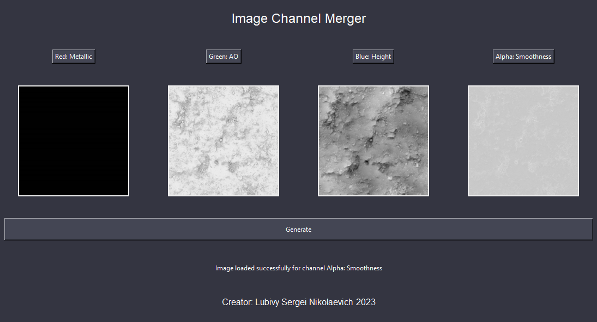
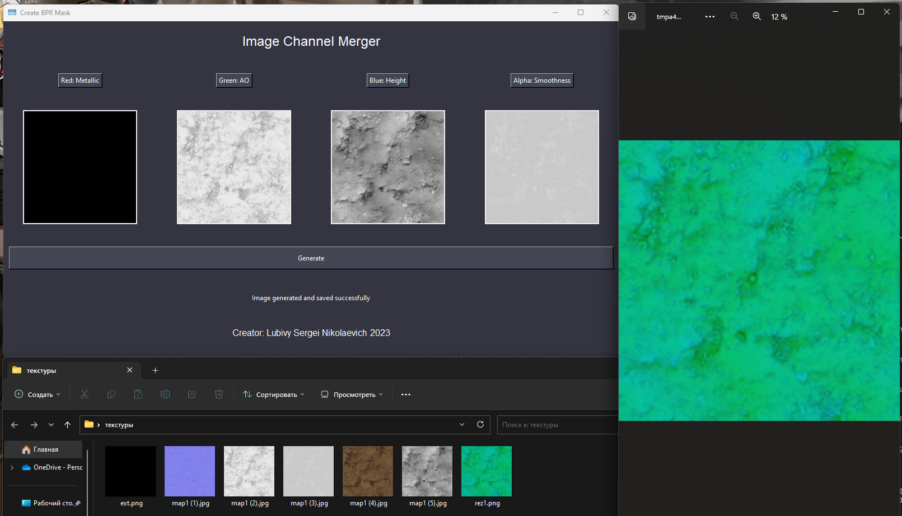

# Program Description: Create Mask Map Unity HDRP

Description:

The "Create Mask Map Unity HDRP" program is a powerful and user-friendly tool designed for game developers and artists working with the Unity High Definition Render Pipeline (HDRP). This application enables users to efficiently generate custom mask maps that play a crucial role in the material workflow of HDRP projects.

Installation:

CMD:

pip install pillow

pip install tk

---------------------------------

import tkinter as tk
from tkinter import filedialog, messagebox
from PIL import Image, ImageTk

=================================

Program window:

Key Features:

Customizable Mask Map Generation: The program empowers users to create personalized mask maps by combining different image channels, such as Metallic, Ambient Occlusion (AO), Height, and Smoothness. This flexibility ensures that the resulting mask map aligns precisely with the specific material requirements of their Unity HDRP project.

Intuitive User Interface: The user interface is designed for ease of use, featuring intuitive controls and buttons for selecting and loading images. Users can seamlessly load channel images for Metallic, AO, Height, and Smoothness by clicking on corresponding buttons.

Working principle:

Real-time Previews: The application provides real-time previews of the loaded channel images, allowing users to visualize the impact of their selections. These previews aid in making informed decisions during the mask map creation process.

Effortless Mask Map Generation: Once the desired images are loaded, users can effortlessly generate the final mask map with a single click. The program automatically combines the selected channels to create a comprehensive and accurate mask map that conforms to HDRP's standards.

Export and Save: After generating the mask map, users have the option to export and save the image in PNG format. This feature ensures that the created mask map can be directly imported into their Unity HDRP project for immediate use.

Author Information: The application includes information about the creator, providing users with insight into the developer behind the tool. This author information is displayed in the interface, adding a personal touch to the program.

In summary, the "Create Mask Map Unity HDRP" program simplifies and streamlines the process of generating mask maps for Unity HDRP projects. Its user-friendly interface, real-time previews, and ability to customize mask maps make it an indispensable tool for game developers and artists seeking to enhance their workflow and achieve outstanding visual results in Unity's High Definition Render Pipeline.

Result:

